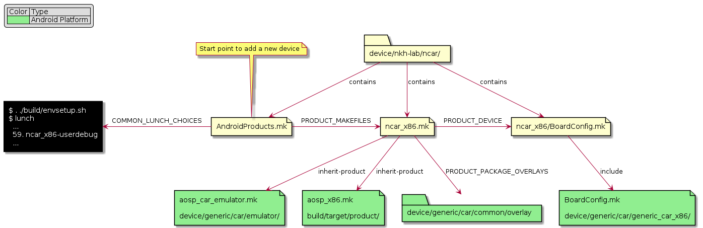

# aosp-ncar-device

Project for adding new `ncar_x86` device to AOSP within [NCAR - Android Automotive Emulator Project](https://github.com/nkh-lab/aosp-ncar-manifest).

Based on `device/generic/car/aosp_car_x86.mk`.

## Device deployment diagram

The following diagram shows all mk files depedencies for `ncar_x86` device:

Link to full size image

This diagram was built using [aosp-devicemk-parser](https://github.com/nkh-lab/aosp-devicemk-parser) tool.
